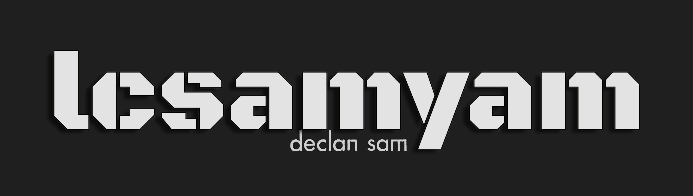

<!-- Header -->
   
<h1 align="center"> Hi! My name is Samyam Lamichhane!</h1>
<h3 align="center" style = "font-size: 25px;">A deep learning practitioner and a photography enthusiast.</h3>

<!-- Socials -->

  
  
  

<!-- Image -->
 

  

<!-- About Me -->
 

  

    <!-- <picture>
      
    </picture> -->
  

  <h2 style = "margin-left: 10px; margin-top:23px">About me</h2>

  
Welcome to my profile!

  <ul>
    - I'm a Junior Research Scientist (full-time) and a recent graduate from NYU with a focus in computer vision and reinforcement learning.  
     
    - Previously, I conducted research at robotics & reinforcement learning with PAL Robotics systems using omnidirectional mobility and LiDAR perception to train mobile manipulators for precise object manipulation at <a href="https://nyuad.nyu.edu/en/research/faculty-labs-and-projects/center-for-artificial-intelligence-and-robotics.html" target="_blank"> Center of AI and Robotics (CAIR) </a>  
     
    - I also developed computer vision solutions with deep residual networks for soiling quantification using novel CNN and Transformer architectures.  
     
    - Research Interests: Computer vision, reinforcement learning and multi-modal learning.  
     
    - I led web development project for <a href="https://janetnjelesani.com/" target="_blank">Dr. Janet Njelesani</a> at NYU.  
    - I am on a lookup for research opportunities in machine learning, vision and embodied AI.  
  </ul>

<!-- Call to action for website -->

  

 

<h3 align="center" style = "font-size: 25px;"> Languages & Tools</h3>

<!-- Tools -->
<table align="center">
  <tr>
    <td><strong>Languages</strong></td>
    <td>  </td>
  </tr>
  <tr>
    <td><strong>ML Tools</strong></td>
    <td>              </td>
  </tr>
  <tr>
    <td><strong>Ops Tools</strong></td>
    <td>         
    </td>
  </tr>
  <tr>
    <td><strong>Web</strong></td>
    <td>         </td>
  </tr>
  <tr>
    <td><strong>Creative</strong></td>
    <td>     </td>
  </tr>
</table>

<!-- Stats -->

  

  

  

  <!--  -->

